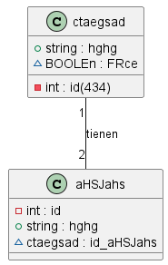

# `ANDRES BURGUER`

#### Introducción:
   Este documento especifica los requisitos del software para el desarrollo de un sitio web para el restaurante "Nombre del Restaurante". El objetivo del sistema es proporcionar a los clientes una plataforma en línea donde puedan ver el menú, realizar pedidos, reservar mesas y obtener información sobre el restaurante. 

  `Objetivo:`
    El objetivo del sistema es proporcionar una plataforma para almacenar y gestionar información relacionada con categorías y sus respectivos atributos.

  `Descripción General:`
    El sistema deberá permitir la creación, modificación, eliminación y consulta de datos relacionados con las categorías.

  `Requisitos Funcionales:`

    Interfaz de Usuario: El sitio web debe tener una interfaz de usuario intuitiva y fácil de usar.

    1. Debe haber una página de inicio que presente información básica sobre el restaurante y sus servicios.

    2. Se debe proporcionar una página de menú que muestre los platos disponibles, sus descripciones y precios.

    3. Los usuarios deben poder agregar elementos al carrito de compras y realizar pedidos.

    4. Debe haber una página de reserva de mesa donde los usuarios puedan seleccionar la fecha, hora y número de comensales.

    5.Los clientes deben poder registrarse e iniciar sesión en sus cuentas.
    
   Funcionalidades del Sistema:El sistema debe permitir a los administradores del restaurante agregar, editar y eliminar elementos del menú.

    1. Debe haber un sistema de gestión de pedidos que permita a los empleados del restaurante recibir, procesar y completar pedidos en tiempo real.

    2. El sistema debe enviar notificaciones por correo electrónico a los clientes para confirmar sus pedidos y reservas.

   `Requisitos No Funcionales:` El sitio web debe ser compatible con diferentes navegadores web, incluyendo Chrome, Firefox y Safari.

    1. Debe ser responsive, adaptándose a diferentes tamaños de pantalla, como dispositivos móviles y tabletas.

    2. Se debe garantizar la seguridad de los datos del cliente mediante el uso de cifrado SSL.

    3. El sitio web debe tener un tiempo de carga rápido para mejorar la experiencia del usuario.

    4. Debe ser desarrollado utilizando tecnologías Java y seguir las mejores prácticas de desarrollo web.
    
    5. Tener un tiempo de respuesta rápido para las operaciones de consulta y modificación de  datos.
   

`categorias_de_carros`:En esta tabla se almanesara Id, Categoria, tipo de vehiculo y descripción.

| id | categoria         | tipo_vehiculo | descripción |
|----|-------------------|---------------|-------------|
| 1  | alto cilindraje   |deportivo      | idal        |
| 2  | alto cilindraje   |trocha         |idal         |
| 3  | alto cilindraje   |deportivo      |idal         |


`autos`: En esta tabla se guardara de manera autoincremental y automantica los autos que se ingresen.

| id | marca         | garantia | cilindraje | id_categorias_de_carros | descripción|
|----|---------------|----------|------------|-------------------------|------------|
| 1  |    bmw        | 1 año    |3000        |  1                      | ideal      |
| 2  |   toyota      | 2 años   |2000        |  2                      | ideal      |
| 3  |   bugati      | 4 años   |6000        |  3                      | ideal      |

`persona`: En esta tabla se almacenara de maneta autoincremental y automatica los clientes.

| id | nombre        | apellido | telefono | dirección   | documento|
|----|---------------|----------|----------|-------------|----------|
| 1  |    jose       | vargas   |3145789   | cll 11 24   | 1543820  |
| 2  |  leonardo     | herrera  |3256879   | cll 1 18    | 1578928  |
| 3  |  julian       | romero   |3147899   | cr 12 78 sur| 1687872  |

`Autos_persona`

| id | id_autos | id_persona | descripción |
|----|----------|------------|-------------|
| 1  |  1       |   1        |comprado     |
| 2  |  2       |   2        |comprado     |
| 3  |  3       |   3        |comprado     |


> Script de la base de datos
```sql
    DROP DATABASE IF EXISTS parcial;

    CREATE DATABASE parcial;

    USE parcial;

    CREATE table categorias_de_carros (
        id INT NOT NULL PRIMARY KEY AUTO_INCREMENT,
        categoria VARCHAR1(150) NOT NULL UNIQUE,
        tipo_vehiculo VARCHAR(150) NOT NULL,
        descripción VARCHAR(150) NOT NULL
        
    ); 

    CREATE table autos (
        id INT NOT NULL PRIMARY KEY AUTO_INCREMENT,
        marca VARCHAR(150) NOT NULL,
        garantia DATE NOT NULL,
        cilindraje INT NOT NULL,
        FOREIGN KEY (id_categorias_de_carros) REFERENCES categorias_de_carros(id),
        descripciónVARCHAR(150) NOT NULL
    ); 

    CREATE table persona (
        id INT NOT NULL PRIMARY KEY AUTO_INCREMENT,
        nombre VARCHAR1(150) NOT NULL UNIQUE,
        apellido VARCHAR(150) NOT NULL,
        telefono INT NOT NULL,
        dirección VARCHAR(150) NOT NULL,
        documento INT NOT NULL
    ); 

    CREATE table Autos_persona  (
        id INT NOT NULL PRIMARY KEY AUTO_INCREMENT,
        FOREIGN KEY (id_autos) REFERENCES autos(id),
        FOREIGN KEY (id_persona) REFERENCES persona(id),
        descripción VARCHAR(150) NOT NULL
        
    ); 
```



[ingresar](https://trello.com/b/epoUPRg2/parcial)