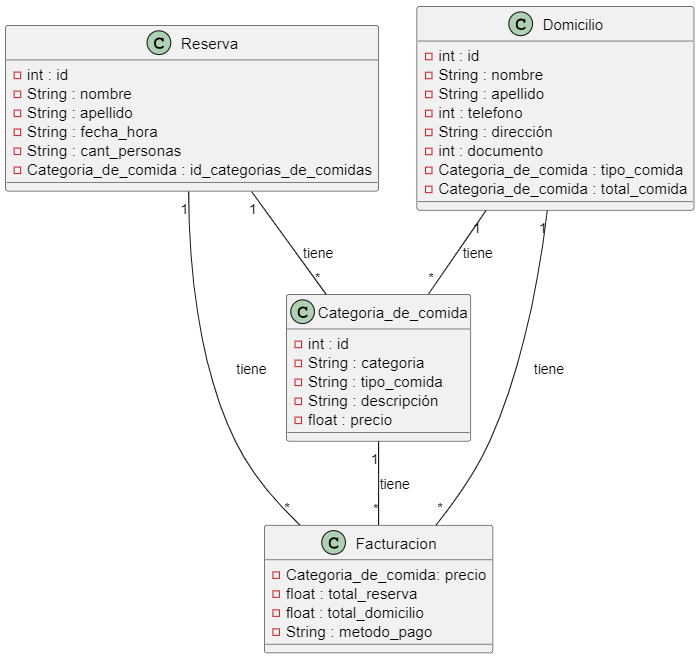

# `ANDRES BURGUER`

#### Introducción:
   Este documento especifica los requisitos del software para el desarrollo de un sitio web para el restaurante "Nombre del Restaurante". El objetivo del sistema es proporcionar a los clientes una plataforma en línea donde puedan ver el menú, realizar pedidos, reservar mesas y obtener información sobre el restaurante. 

  `Objetivo:`
    El objetivo del sistema es proporcionar una plataforma para almacenar y gestionar información relacionada con categorías y sus respectivos atributos.

  `Descripción General:`
    El sistema deberá permitir la creación, modificación, eliminación y consulta de datos relacionados con las categorías.

  `Requisitos Funcionales:`

    Interfaz de Usuario: El sitio web debe tener una interfaz de usuario intuitiva y fácil de usar.

    1. Debe haber una página de inicio que presente información básica sobre el restaurante y sus servicios.

    2. Se debe proporcionar una página de menú que muestre los platos disponibles, sus descripciones y precios.

    3. Los usuarios deben poder agregar elementos para realizar pedidos.

    4. Debe haber una página de reserva de mesa donde los usuarios puedan seleccionar la fecha, hora y número de comensales.

    5.Los clientes deben poder registrarse.
    
   Funcionalidades del Sistema:El sistema debe permitir a los administradores del restaurante agregar, editar y eliminar elementos del menú.

    1. Debe haber un sistema de gestión de pedidos que permita a los empleados del restaurante recibir, procesar y completar pedidos en tiempo real.

    2. El sistema debe enviar notificaciones por correo electrónico a los clientes para confirmar sus pedidos y reservas.

   `Requisitos No Funcionales:` El sitio web debe ser compatible con diferentes navegadores web, incluyendo Chrome, Firefox y Safari.

    1. Debe ser responsive, adaptándose a diferentes tamaños de pantalla, como dispositivos móviles y tabletas.

    2. Se debe garantizar la seguridad de los datos del cliente mediante el uso de cifrado SSL.

    3. El sitio web debe tener un tiempo de carga rápido para mejorar la experiencia del usuario.

    4. Debe ser desarrollado utilizando tecnologías Java y seguir las mejores prácticas de desarrollo web.
    
    5. Tener un tiempo de respuesta rápido para las operaciones de consulta y modificación de  datos.
   

`Categoria de comida`:En esta tabla se almanesara Id, Categoria, tipo de comida y descripción.

| id | categoria         | tipo_comida    |                              descripción                                   |
|----|-------------------|----------------|----------------------------------------------------------------------------|
| 1  | Hamburguesa       | clasica              |150gm carne de res, queso, lechuga, tomate, cebolla, salsa de la casa                                                                                                |
| 2  | Hamburguesa       | Ranchera             |150gr de carne de res, tocineta, chorizo, maíz tierno, queso mozzarella, cebolla caramelizada, tomate, lechuga y salsas de la casa                                           |
| 3  | Hamburguesa       | Onion Ring's         |150gr de carne de res, tocineta, queso mozzarella, aros de cebolla, lechuga, tomate y salsas de la casa                                                                 |
| 4  | Hamburguesa       | Callejera            |150gr de carne de res, piña caramelizada, papa ripio, cebolla caramelizada, queso mozzarella, tomate, lechuga y salsas de la casa                                 |
| 5  | Hamburguesa       | Criolla Burger       |150gr de carne de res, huevo frito, tocineta, queso cheddar, cebolla caramelizada, lechuga, tomate y salsas de la casa                                                   |
| 6  | Hamburguesa       | Andres Burger        |2 tapas de carne de res 150gr c/u cebolla crujiente, queso cheddar, pepinillos, tomate, lechuga y salsa de la casa                                                      |
| 7  | Hamburguesa       | La Big Burger        |150gm de pechuga de pollo, 150gr de carne de res, doble tocineta, doble queso cheddar, piña caramelizada, aros de cebolla cruda, tomate, lechuga y salsas de la casa        |
| 8  | Hamburguesa       | Mexicana             |150gr de carne de res, tocineta jalapeños, nachos guacamole casero, queso cheddar, lechuga, tomate y salsas de la casa                                                  |
| 9  | Hamburguesa       | Pollo Crunch         |150gr de pechuga de pollo empanizada, lechuga, tomate, mayonesa y salsa BBQ                                                                                                 |
| 10 | Hamburguesa       | Burger Cheddar       |300g de carne de res, doble queso cheddar, plátano maduro, tomate, lechuga y salsa de la casa                                                                          |
| 11 | Hamburguesa       | Hawaiana Burger      |150g de carne de res, piña asada, queso yaguareño, tocino, tomate, lechuga y salsa de la casa                                                                          |
| 12 | Hamburguesa       | Argentina            |150gr de carne de res, 120gr de lomito de cerdo, chorizo santarosano, queso mozzarella, chimichurry, tomate, lechuga, salsa de la casa                                    |
| 13 | Hamburguesa       | Ranchera Doble       |300gr de carne de res, chorizo de las brizas, tocinate, queso cheddar, chimichurry casero, lechuga, tomate y salsas de la casa                                             |
| 14 | Perros Calientes  | Tradicional          |Salchicha americana, cebolla cruda, queso mozzarella, piña caramelizada, papa ripio                                                                                          |
| 15 | Perros Calientes  | Mexicano             |Salchicha americana, queso mozzarella, cebolla cruda, nachos picados, guacamole casero y jalapeños                                                                        |
| 16 | Perros Calientes  | Cheese Corn          |Salchicha americana, envuelta con dos tocinetas, cebolla grille y queso fundido con maiz tierno                                                                             |
| 17 | Perros Calientes  | Ranchero             |Salchicha americana, carne desmechada, maíz tierno, cebolla cruda y queso mozzarella                                                                                    |
| 18 | Perros Calientes  | Chori Americano      |Chorizo artesanal, cebolla cruda, queso mozzarella, papa ripio, salsa de tomate y mostaza                                                                                    |
| 19 | Bebidas           | Coca-Cola            |Coca-Cola 400 mili litros                                                                                              |
| 20 | Bebidas           | Coca-Cola            |Coca-Cola 1.5 litros                                                                                              |
| 21 | Bebidas           | Limonadas            |Limonada de Coco, Cereza, Natural                                                                                             |
| 22 | Bebidas           | Jugos Hit            |Jugos Hit de todos los sabores disponibles                                                                                         |
| 23 | Bebidas           | Agua en botella      |Agua en Botella                                                                                             |
| 24 | Bebidas           | Gaseosa              |Gaseosas de 1.5 litros                                                                                              |
| 25 | Otros Productos   | Alitas X10           |10 unidades de alitas bañadas en tu salsa favorita acompañada de papa a la francesa                                                                                         |
| 26 | Otros Productos   | Alitas X20           |20 unidades de alitas bañadas en tu salsa favorita acompañada de papa a la francesa o cascos de papa                                                                        |
| 27 | Otros Productos   | Finger de Pollo      |Tiras de pechuga pollo apanadas con pan o acompañadas de papa francesa o yucas fritas y ensalada de la casa                                                                  |
| 28 | Otros Productos   | Brocheta de lommito  |Brocheta de lomito fino con chimichurry acompañado de papa francesa o yuca y nuestro tomate relleno de puré de papa y queso gratinado                                     |
| 29 | Otros Productos   | Costillas            |100gr de carne desmechada 100gr de pollo desmechado, queso mozzarella, tocineta, maíz desgranado y salsas de la casa                                                       |
| 30 | Otros Productos   | Churrasco            |300gr de lomo ancho, acompañado de papas a la francesa o cascos de papa, patacona, ensalada dulce o ensalada                                                                 |
| 31 | Otros Productos   | Mazorcada            |100gr de carne desmechada, 100gr de pollo desmechado, queso mozzarella, tocineta, maíz desgranado y salsas de la casa                                                       |
| 32 | Otros Productos   | Salchipapa           |250gr de papa a la francesa, 2 unidades de salchicha americana y queso                                                                                               |
| 33 | Otros Productos   | Mazorcada            |Chips de platanitos maduros con pollo desmechado, carne desmechada, tiras de tocineta, una combinación de maíz tierno y maiz recién desgranado, queso fundido y chips de papas|
| 34 | Otros Productos   | Mega papitas Andres  |250gr de papas fritas, pollo desmechado, chorizo ​​casero, salchicha americana, salsa de la casa, queso derretido y guacamole casero                                     |
| 35 | Otros Productos   | Papitas Andres Burger|250gr de papas fritas, 100gr de carne deshebrada, 100gr de pollo deshebrado y guacamole casero                                                                       |
| 36 | Otros Productos   | Adicionales          |Carne, queso, tocineta, salchicha, huevo frito, chorizo, pollo desmechado, patacón, carne desmechada                                                               |
| 37 | Otros Productos   | Acompañamientos      |Papa francesa, aros de cebolla, yuquitas, ensalada, tomate relleno, ensalada dulce                                                                                      |

`Reserva`: En esta tabla se guarda la id, datos del cliente, pedido y facturacion.

| id | Datos_cliente | Pedido | Facturación | Descripcion|
|----|---------------|--------|-------------|------------|
| 1  | Nombre y apellido | Pedido anticipado | Facturación | Descripcion del pedido |

`Domicilio`: En esta tabla se guardara la id, nombre, apellido, telefono, direccion, documento, descripcion, factura.

| id | nombre | apellido | telefono | direccion | documento | descripcion | factura |
|----|--------|----------|----------|-----------|-----------|-------------|---------|
| 1  | Nombre del cliente | Apellido del cliente | Telefono del cliente | Documento del cliente | Descripcion del pedido | Factura de la cuenta total | 

[ingresar](https://trello.com/b/epoUPRg2/parcial)